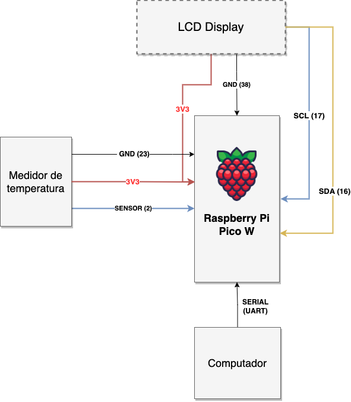
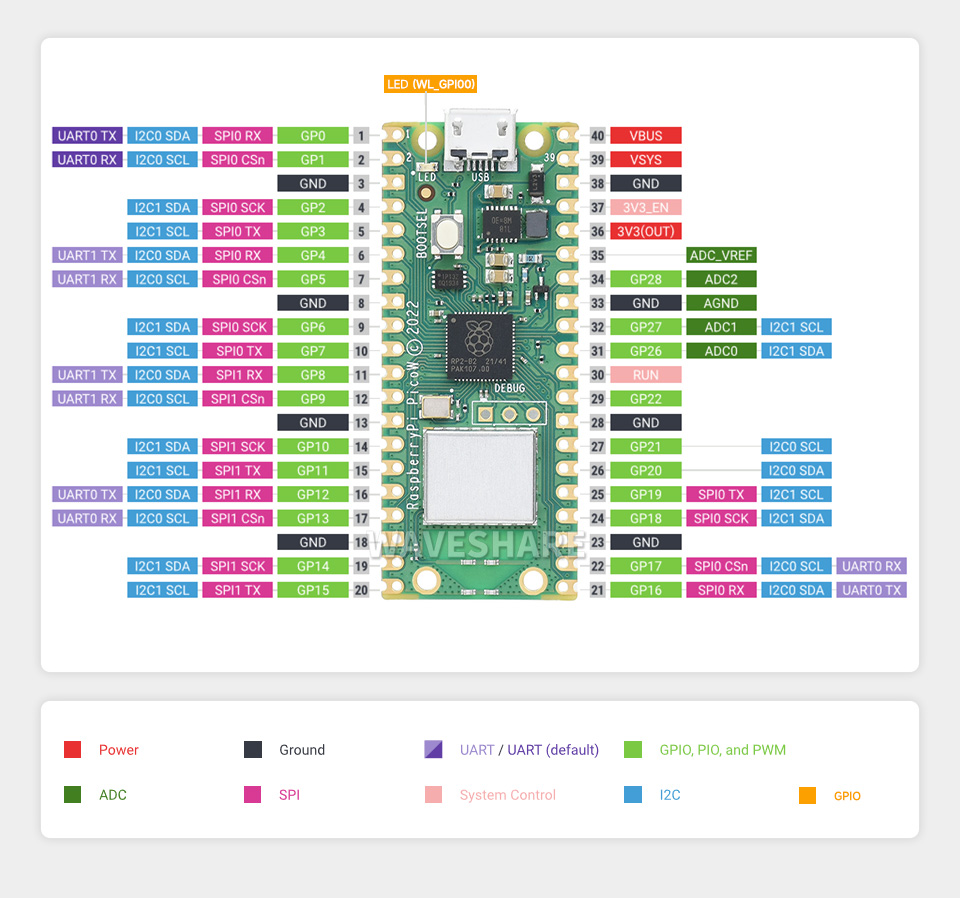

# Medidor de Temperatura com Comunicação Serial I2C

O projeto do Medidor de Temperatura com Display LED I2C é uma solução eficiente para monitoramento de temperatura em tempo real. Este projeto foi desenvolvido utilizando o microcontrolador Raspberry Pi Pico, conhecido pela sua versatilidade, juntamente com um sensor de temperatura e um display LED I2C para uma visualização clara e direta.

O objetivo deste projeto é fornecer um dispositivo confiável e fácil de usar para medir temperaturas em diferentes ambientes, como em casa, escritórios, carros ou até mesmo saídas de ar de nossos computadores, como foi visto nos vídeos anteriores. Através de uma interface simplificada, o usuário pode obter leituras de temperatura precisas e instantâneas, exibidas de maneira clara no display LED I2C.

Este documento README destina-se a fornecer todas as informações necessárias para compreender, montar e operar o Medidor de Temperatura com Display LED I2C. Aqui você encontrará detalhes sobre o hardware utilizado, a descrição do funcionamento da comunicação I2C e serial, além de um vídeo demonstrativo que ilustra o funcionamento prático do projeto.

## Conteúdo
- [Descrição do Hardware](#descrição-do-hardware)
- [Comunicação I2C e Serial](#comunicação-i2c-e-serial)
- [Vídeo Demonstrativo](#vídeo-demonstrativo)
- [Como Usar](#como-usar)

## Descrição do Hardware

No projeto de Medidor de Temperatura e Umidade, utilizamos componentes-chave para criar um dispositivo eficiente e confiável. A seguir estão os detalhes dos componentes utilizados:

1. **Raspberry Pi Pico W**: O cérebro do nosso projeto, o Raspberry Pi Pico W é um microcontrolador de baixo custo, mas poderoso, com capacidades de Wi-Fi integradas. Ele oferece excelente desempenho para processar os dados de temperatura e umidade, além de facilitar a comunicação com outros dispositivos ou redes.

2. **Sensor de Temperatura e Umidade DHT11**: Este sensor é utilizado para medir a temperatura e a umidade do ambiente. O DHT11 é conhecido por sua facilidade de uso e precisão razoável, tornando-o ideal para aplicações domésticas e educacionais.

3. **Display LCD I2C 16x2**: O display LCD I2C 16x2 é usado para mostrar as leituras de temperatura e umidade. Sua interface I2C simplifica a conexão com o Raspberry Pi Pico W, reduzindo a quantidade de pinos necessários para a comunicação e permitindo uma montagem mais organizada e menos complexa.

### Diagrama de Blocos

O diagrama de blocos detalhado abaixo, ajuda a ilustrar a conexão entre o Raspberry Pi Pico W, o sensor DHT11 e o display LCD I2C 16x2. O diagrama inclui:

- As conexões de alimentação (VCC, GND) e de dados (SCL, SDA para o LCD I2C; pinos de sinal para o DHT11) entre o Raspberry Pi Pico W e os outros componentes.
- Uma representação clara de como cada componente está conectado ao microcontrolador.
- Detalhes relevantes para cada componente, como pinagem e funções.

Abaixo, você encontra o DataSheet do Raspberry Pi Pico W, que facilitará sua implementação:

## Comunicação I2C e Serial

### Comunicação I2C

A comunicação I2C (Inter-Integrated Circuit) é um protocolo de comunicação em série usado para conectar dispositivos de baixa velocidade como microcontroladores, sensores, e, no caso do seu projeto, um display LCD. I2C é um protocolo de comunicação de dois fios que utiliza linhas SCL (Serial Clock) e SDA (Serial Data). O SCL é usado para sincronizar todos os dispositivos na linha de comunicação I2C, enquanto o SDA é usado para a transmissão de dados.

Cada dispositivo conectado ao barramento I2C possui um endereço único. No caso do display LCD I2C, ele terá um endereço específico que o microcontrolador usa para se comunicar diretamente com ele. Na comunicação I2C, há sempre um mestre (neste caso, o Raspberry Pi Pico) e um ou mais escravos (como o display LCD). O mestre inicia a comunicação e gera o sinal de clock necessário para a transferência de dados.

A comunicação I2C é vantajosa por sua simplicidade e eficiência, especialmente para dispositivos como displays LCD, onde a quantidade de dados transferidos não é extensa e a velocidade de comunicação não precisa ser muito alta. Além disso, o uso de apenas dois fios para comunicação facilita o design do circuito e a redução do uso de pinos no microcontrolador.

(SOUZA, F. Comunicação I2C. Disponível em: <https://embarcados.com.br/comunicacao-i2c/>.)

### Comunicação Serial

A comunicação serial entre o computador e o microcontrolador, como o Raspberry Pi Pico, é uma maneira fundamental de trocar dados entre esses dispositivos. Este processo envolve usar uma das interfaces de comunicação serial do Raspberry Pi Pico, tipicamente UART (Universal Asynchronous Receiver/Transmitter), para transmitir e receber dados.

Primeiro, é necessário configurar a interface serial no Raspberry Pi Pico. Isso envolve definir os pinos para transmissão (TX) e recepção (RX) de dados, além de configurar a taxa de transmissão (baud rate), que deve ser a mesma no microcontrolador e no computador. A conexão física pode ser feita diretamente através de um cabo USB, se o Raspberry Pi Pico suportar comunicação serial sobre USB, ou através de um adaptador USB para TTL (Transistor-Transistor Logic) se uma conexão direta não for possível.

Uma vez estabelecida a conexão, o microcontrolador pode enviar dados para o computador. Isso é feito escrevendo dados no buffer de transmissão da UART. Quando o buffer é preenchido, os dados são enviados sequencialmente através do pino TX. De maneira similar, o microcontrolador pode receber dados do computador. Os dados enviados pelo computador são recebidos no pino RX do microcontrolador e armazenados no buffer de recepção da UART. O microcontrolador pode então ler esses dados.

(REZENDE, R. Raspberry Pi - Comunicação Serial (UART) entre a Raspberry Pi e Arduino em Python e Wiring. Disponível em: <https://embarcados.com.br/raspberry-pi-comunicacao-serial-uart/>.)

## Vídeo Demonstrativo

O vídeo demonstrativo pode ser acessado através [desse link, clicando aqui](https://youtu.be/aSM7Uxoy3-Q).

Como complemento, abaixo estão os links dos vídeos anteriores da nossa solução:

[MQTT + Medidor de temperatura (2ª ponderada)](https://youtu.be/3DOCCmh5PPg?si=sueRGbII2pGEGgl7)

[Medidor de temperatura + Front (1ª ponderada)](https://youtu.be/XEdLyp86nX0)

## Como Usar

Todo o código fonte necessário para executar a aplicação está dentro da pasta [Raspberry](./Raspberry).
